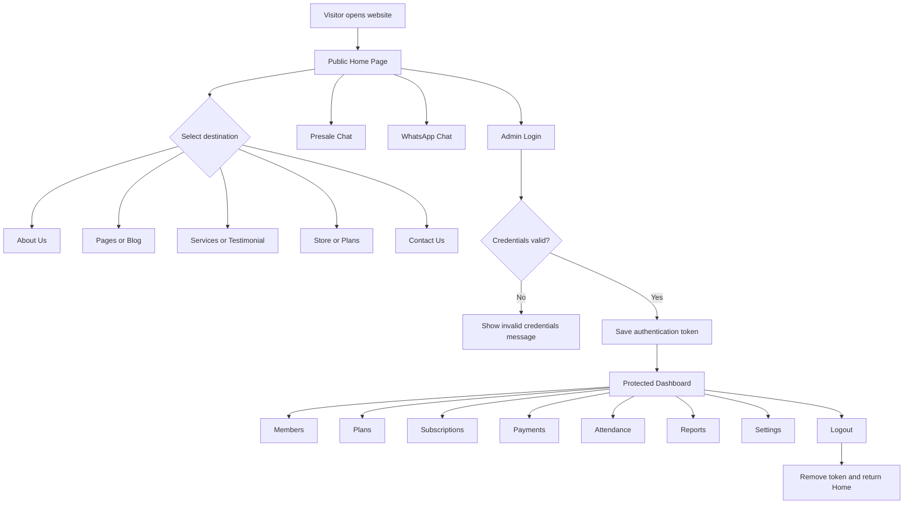
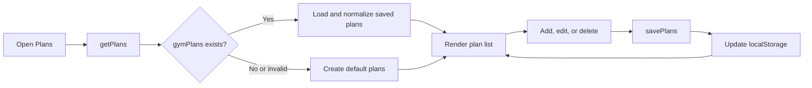

# Fitness Gym Management

A responsive gym website and admin management dashboard built with React, Vite, Tailwind CSS, React Router, and browser `localStorage`.

The project has two main areas:

1. **Public website** — home page, gym information, services, testimonials, plans, store, blog, contact page, presale chat, and WhatsApp contact.
2. **Admin dashboard** — protected management screens for members, plans, subscriptions, payments, attendance, reports, and settings.

## Technology Stack

| Technology | Purpose |
| --- | --- |
| React | Component-based user interface |
| Vite | Development server and production build |
| Tailwind CSS | Responsive styling |
| React Router | Public and protected page navigation |
| React Context | Authentication state |
| localStorage | Demo authentication and plan persistence |
| React Icons | Navigation and interface icons |
| Recharts | Dashboard charts |
| Axios | Available for future API integration |

## Application Workflow



## Public Website Workflow

### Header navigation

The public navigation contains:

- **HOME** — returns to the main hero section.
- **ABOUT US** — scrolls to the About section.
- **PAGES** — opens the public Pages screen.
- **SERVICES** — scrolls to gym services.
- **TESTIMONIAL** — scrolls to member testimonials.
- **BLOG** — opens the public Blog screen.
- **STORE** — opens the gym products page.
- **CONTACT US** — opens the contact page.

The navigation becomes a mobile menu on smaller screens.

### Home page

The Home page workflow is:

1. Visitor sees the gym hero section and primary navigation.
2. Visitor can scroll through About, Features, Testimonials, Services, and Footer sections.
3. The **Presale Chat** button stays in the bottom-left corner.
4. The **WhatsApp** button stays in the bottom-right corner and opens a pre-filled WhatsApp message.
5. The Login button opens the admin authentication screen.

### Store

The Store page allows a visitor to:

1. Search products by name.
2. Filter products by category.
3. Add products to the local cart.
4. View the cart item count and calculated total.

The current cart is component state and resets after a page refresh.

### Contact page

The visitor can enter their contact details and message. The current implementation shows a successful submission state locally; it does not send data to a backend.

## Authentication Workflow

This project currently uses demo frontend authentication.

### Demo credentials

```text
Email: admin@gmail.com
Password: 123456
```

### Login sequence

1. Admin enters the demo email and password.
2. Valid credentials call `loginUser()` from `AuthContext`.
3. `services/auth.js` stores `gym-admin-token` in browser `localStorage`.
4. The admin is redirected to `/dashboard`.
5. `ProtectedRoute` checks the authentication state before rendering admin routes.
6. Logout removes the token and redirects to the public home page.

> This is a demonstration flow only. Production use requires a backend authentication API, secure HTTP-only cookies, password hashing, authorization rules, and server-side validation.

## Admin Dashboard Workflow

The admin layout contains a fixed sidebar and a top navigation bar.

### Sidebar behavior

- Expanded state displays the logo, menu icons, and menu labels.
- Collapsed state displays menu icons only.
- The expanded state uses a three-line collapse control.
- The collapsed state uses a double-chevron expand control.
- The sidebar does not scroll; only the main dashboard content area scrolls.
- On mobile, the sidebar opens as an overlay menu.

### Dashboard modules

| Module | Route | Purpose |
| --- | --- | --- |
| Dashboard | `/dashboard` | Overview cards and gym metrics |
| Members | `/members` | View and manage gym members |
| Add Member | `/members/add` | Create a member record |
| Edit Member | `/members/edit/:id` | Update a selected member |
| Plans | `/admin/plans` | View and manage admin membership plans |
| Add Plan | `/admin/plans/add` | Create a membership plan |
| Edit Plan | `/admin/plans/edit/:id` | Update a membership plan |
| Subscriptions | `/subscriptions` | Track membership subscriptions |
| Payments | `/payments` | View payment and revenue information |
| Attendance | `/attendance` | Track member attendance |
| Reports | `/reports` | View gym reports |
| Settings | `/settings` | Manage application settings |

### Membership plan data flow



Membership plan records use the `gymPlans` localStorage key. Invalid or missing data is replaced with safe default plans.

## Route Structure

### Public routes

| Route | Screen |
| --- | --- |
| `/` | Home |
| `/login` | Admin Login |
| `/pages` | Pages |
| `/blog` | Blog |
| `/shop` | Store |
| `/plans` | Public Plans |
| `/contacts` | Contact Us |

### Protected routes

All dashboard routes are wrapped by `ProtectedRoute` and rendered inside `AdminLayout`.

Unauthenticated users cannot access the admin dashboard. They are redirected to the public home page.

## Project Structure

```text
gym-admin/
├── public/                 Static public assets
├── src/
│   ├── assets/             Images and brand logo
│   ├── components/         Shared UI components
│   ├── context/            Authentication context
│   ├── layouts/            Admin dashboard layout
│   ├── pages/
│   │   ├── attendance/     Attendance module
│   │   ├── members/        Member CRUD screens
│   │   ├── payments/       Payment module
│   │   ├── plans/          Admin plan CRUD and storage
│   │   ├── reports/        Reports module
│   │   ├── settings/       Settings module
│   │   └── subscriptions/  Subscription module
│   ├── services/           Authentication/API helpers
│   ├── utils/              Constants and utility functions
│   ├── App.jsx             Route definitions
│   ├── index.css           Global Tailwind and base styles
│   └── main.jsx            React application entry point
├── package.json
└── vite.config.js
```

## Getting Started

### Prerequisites

- Node.js 18 or newer
- npm

### Installation

```bash
git clone <your-repository-url>
cd gym-admin
npm install
```

### Start development server

```bash
npm run dev
```

Open the URL printed by Vite, normally:

```text
http://localhost:5173
```

## Available Commands

| Command | Description |
| --- | --- |
| `npm run dev` | Start the Vite development server |
| `npm run build` | Create a production build in `dist/` |
| `npm run preview` | Preview the production build locally |
| `npm run lint` | Run ESLint across the project |

## Production Build

```bash
npm run build
npm run preview
```

The optimized application is generated inside the `dist/` directory.

## Current Data and Backend Limitations

- Authentication is browser-based demo authentication.
- Membership plans persist in `localStorage`.
- Store cart data does not persist after refresh.
- Contact and newsletter forms do not send real messages.
- Dashboard data is currently frontend/demo data.
- WhatsApp uses the configured number in `Home.jsx`.
- A backend API and database are required for production usage.

## Recommended Production Workflow

For a production-ready system:

1. Connect the frontend to a secured REST or GraphQL API.
2. Add a database for members, plans, subscriptions, payments, and attendance.
3. Replace demo authentication with server-side authentication and role-based access.
4. Add form validation and backend error handling.
5. Integrate a payment gateway.
6. Connect contact/newsletter forms to email or CRM services.
7. Store WhatsApp and gym contact details in environment variables or admin settings.
8. Add automated component, integration, and end-to-end tests.

## Brand Asset

The shared public/admin logo is rendered through:

```text
src/components/BrandLogo.jsx
```

The current dark-background-compatible logo asset is:

```text
src/assets/fitness-gym-logo-v2.png
```
